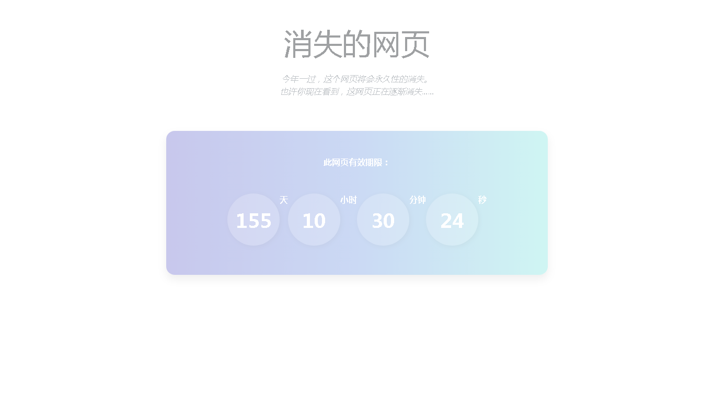

### Hosted by:

# Side Project —— 消失的网页
- 在某天没事做的时候，看到这个人的repository：
[not paid](https://github.com/kleampa/not-paid)
- 于是就灵机一动，做一个会逐渐消失的倒数网站吧！

# 所使用的各种插件：
### 
 —— css架构
- style.css —— 倒数器外观设计

### 
-  —— 核心JS，也是我目前最喜欢用的框架（或者说，最熟悉的）
	- countdown.js —— JQuery的插件，用来控制倒数机制

# 主要内容：
### 
- 随着时间变迁，网页的透明度将会逐渐增加
- 建议每个月回去看一次，你会发现网页将会越来越不可读w

# 目前进度：
- Index：
